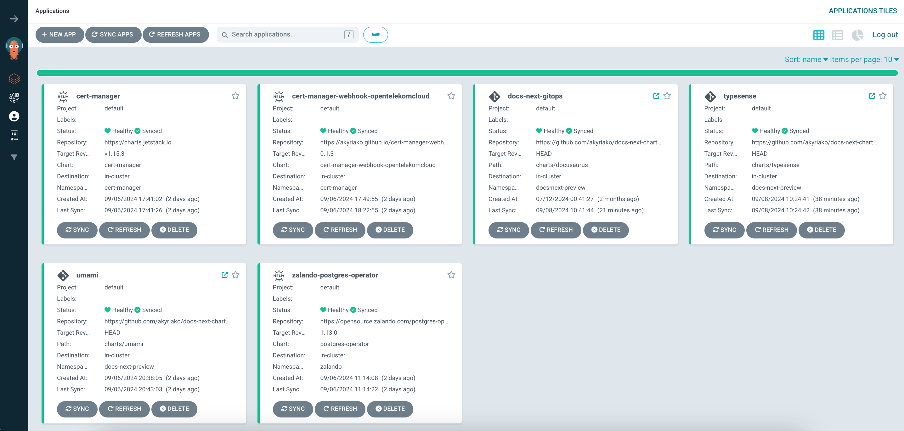

# Step-by-Step Deployment

> [!IMPORTANT]
> - All steps are mandatory 
> - The execution order matters. Follow the manual sequentially.
> - The manual is tailored for installation on CCE Clusters, not suitable for other hypervisors or bare-metal Kubernetes Clusters.

## Dependencies

First we need to install all the dependencies and third components that support the functionality:

### Argo CD

[Argo CD](https://argo-cd.readthedocs.io/en/stable/) is a declarative, GitOps continuous delivery tool for Kubernetes. It automates the deployment and lifecycle management of applications from Git repositories to specified target environments.

#### Install the Helm Chart

```shell
helm repo add argo https://argoproj.github.io/argo-helm
helm repo update

helm install \
    argocd argo/argo-cd \
    --namespace argocd \
    --create-namespace
```

> [!IMPORTANT]
> - **argocd** is optional but it is strongly recommended to be used for installing the rest of components for consistency and automation.
> - It is **not** recommended to publish argocd externally via a load balancer or an ingress. Prefer to port forward it to your working host. 

### cert-manager

[cert-manager](https://cert-manager.io/) is an open source project that provides X.509 certificate management for Kubernetes and OpenShift workloads. It supports TLS for Ingress, mTLS for pod-to-pod communication, and integrates with various Issuers and service mesh add-ons. 

#### Install the Helm Chart

```shell
helm repo add jetstack https://charts.jetstack.io 
helm repo update 

helm install \
  cert-manager jetstack/cert-manager \
  --namespace cert-manager \
  --create-namespace \
  --version v1.15.3 \
  --set crds.enabled=true
```

### cert-manager-webhook-opentelekomcloud

[cert-manager-webhook-opentelekomcloud](https://github.com/akyriako/cert-manager-webhook-opentelekomcloud) is an ACME DNS01 solver webhook for Open Telekom Cloud DNS, and requires **cert-manager** to be installed first.

#### Get Access/Secret Keys

Go to My Credentials -> Access Keys and either pick up an existing pair or create a new one:


```shell
export OS_ACCESS_KEY={value}
export OS_SECRET_KEY={value}
```

#### Install the Helm Chart

```shell
helm repo add cert-manager-webhook-opentelekomcloud https://akyriako.github.io/cert-manager-webhook-opentelekomcloud/
helm repo update

helm upgrade --install \
    acme-dns cert-manager-webhook-opentelekomcloud/cert-manager-webhook-opentelekomcloud \
  --set opentelekomcloud.accessKey=$OS_ACCESS_KEY \
  --set opentelekomcloud.secretKey=$OS_SECRET_KEY \
  --namespace cert-manager
```

#### Deploy Cluster Issuers

You are going to need one `ClusterIssuer` for the *production* and one for the *staging* Let's Encrypt endpoint. 

> [!WARNING]
> **cert-manager** has a known bug, that prevents custom webhooks to work with an `Issuer`. For that reason you need to install your issuer as `ClusterIssuer`.

- Staging:

```yaml
apiVersion: cert-manager.io/v1
kind: ClusterIssuer
metadata:
  name: opentelekomcloud-letsencrypt-staging
  namespace: cert-manager
spec:
  acme:
    email: user@company.com
    server: https://acme-staging-v02.api.letsencrypt.org/directory
    privateKeySecretRef:
      name: opentelekomcloud-letsencrypt-staging-tls-key
    solvers:
    - dns01:
        webhook:
          groupName: acme.opentelekomcloud.com
          solverName: opentelekomcloud
          config:
            region: "eu-de"
            accessKeySecretRef:
              name: cert-manager-webhook-opentelekomcloud-creds
              key: accessKey
            secretKeySecretRef:
              name: cert-manager-webhook-opentelekomcloud-creds
              key: secretKey
```

- Production:

```yaml
apiVersion: cert-manager.io/v1
kind: ClusterIssuer
metadata:
  name: opentelekomcloud-letsencrypt
  namespace: cert-manager
spec:
  acme:
    email: user@company.com
    server: https://acme-v02.api.letsencrypt.org/directory
    privateKeySecretRef:
      name: opentelekomcloud-letsencrypt-tls-key
    solvers:
    - dns01:
        webhook:
          groupName: acme.opentelekomcloud.com
          solverName: opentelekomcloud
          config:
            region: "eu-de"
            accessKeySecretRef:
              name: cert-manager-webhook-opentelekomcloud-creds
              key: accessKey
            secretKeySecretRef:
              name: cert-manager-webhook-opentelekomcloud-creds
              key: secretKey
```

> [!IMPORTANT]
> Replace placeholder `email` value, `user@company.com`, with the email that will be used for requesting certificates from Let's Encrypt.

### zalando-postgres-operator

[zalando-postgres-operator](https://github.com/zalando/postgres-operator) creates and manages PostgreSQL clusters running in Kubernetes. The operator delivers an easy to run highly-available PostgreSQL clusters on Kubernetes powered by [Patroni](https://github.com/patroni/patroni). It is configured only through Postgres manifests (CRDs) to ease integration into automated CI/CD pipelines with no access to Kubernetes API directly, promoting infrastructure as code vs manual operations.

#### Install the Helm Chart

```shell
helm repo add postgres-operator-charts https://opensource.zalando.com/postgres-operator/charts/postgres-operator
helm repo update

helm install \
  postgres-operator postgres-operator-charts/postgres-operator \
  --namespace zalando \
  --create-namespace
```

## Prerequisites

After deploying the dependencies we need to provision and configure the following components in Open Telekom Cloud:

### Load Balancers

- Add 3 Shared Load Balancers in the same VPC and Subnet with your CCE Cluster. 
- Let Open Telekom Cloud to assign them with an Elastic IP Address.
- Note down their IDs and their EIPs


### DNS Records

Pick up a domain name for each one of the 3 components e.g.:

- Docusaurus (docs-next): arc.open-telekom-cloud.com 
- Typesense (typesense-reverse-proxy): arc-search.open-telekom-cloud.com
- Umami (umami-web): arc-analytics.open-telekom-cloud.com

For every environment you can suffix the subdomain with the environment identifier e.g.:

- *Production*: arc.open-telekom-cloud.com
- *Staging*: arc-preview.open-telekom-cloud.com
- *Development*: arc-dev.open-telekom-cloud.com

> [!TIP]
> - You **don't need** an Umami instance per enviroment. A single instance suffice and you can then add your different Docusaurus environment for tracking as under Umami Websites.
> - Umami can be installed on a separate management cluster, as long as it is exposed in a manner that would be reachable from all your environments.

Next:

- Go to Domain Name Service -> Public Zones and pick the public zone of your domain.
- Bind the EIP address of a Load Balancer with a domain name by create an A-Record in the DNS zone.


### Kubernetes Namespace

Create a Kubernetes namespace according to the environment you are deploying, e.g. for Staging:

```shell
export DOCS_NEXT_ENVIRONMENT=preview

kubectl create namespace docs-next-$DOCS_NEXT_ENVIRONMENT
```

## Typesense

[Typesense](https://typesense.org/) is a modern, blazing-fast, developer-friendly, open source search engine. It uses cutting-edge algorithms and offers features like typo tolerance, ranking, merchandising, synonyms, geo search, vector search and more.

### Set the environment suffix

```shell
export DOCS_NEXT_ENVIRONMENT=preview
```

> [!TIP]
> You can skip this step if you are deploying the Helm Chart from Argo CD, as it can automatically create the namespaces for you, based on your configuration parameters.

### Install the Helm Chart

```shell
export TYPESENSE_REVERSE_PROXY_ELB_ID={value}
export TYPESENSE_REVERSE_PROXY_HOST={value}
export TYPESENSE_ADMIN_API_KEY=$(echo | openssl dgst -binary -sha256 | openssl base64)
export DOCS_NEXT_HOST={value}

helm repo add docs-next https://akyriako.github.io/docs-next-charts
helm repo update

helm upgrade --install \
    typesense docs-next/typesense \
    --set reverseProxy.ingress.elbId=$TYPESENSE_REVERSE_PROXY_ELB_ID \
    --set reverseProxy.ingress.host=$TYPESENSE_REVERSE_PROXY_HOST \
    --set typesense.apiKey=$TYPESENSE_ADMIN_API_KEY \
    --set docusaurus.externalUrl=$DOCS_NEXT_HOST \
    --namespace docs-next-$DOCS_NEXT_ENVIRONMENT \
    --create-namespace 
```

> [!CAUTION]
> `TYPESENSE_ADMIN_API_KEY` is the administrator's api key and it should never been distributed or made visible to the public during queries. For that reason we will create later a search-only scoped api key that will be used in Docusaurus installation.

### Create a Search-Only Scope API Key

1. Forward container port `80` to local port `9089`. It is very important to stick to these port combination because only the following endpoints are declared as the allowed CORS domains that Typesense will accept calls from:

- **Docusaurus**: `http(s)://$DOCS_NEXT_HOST` 
- **Typesense Dashboard**: `http://localhost:9089` 

2. Sign in the dashboard using the following parameters:


- **Api Key**: value of `TYPESENSE_ADMIN_API_KEY`
- **Protocol**: `https`
- **Host**: value of `TYPESENSE_REVERSE_PROXY_HOST`
- **Port**: `443`


3. Go to *API Keys* -> *Search Key Example* and create a new API key for the collection `docs-next`:


4. Copy the value of the key to the variable `TYPESENSE_SEARCH_API_KEY`.

## Umami

[Umami](https://umami.is/) is a fast, privacy-focused, cookieless, fully GDPR-compliant and open-source alternative to Google Analytics.

### Install the Helm Chart

```shell
export UMAMI_ELB_ID={value}
export UMAMI_HOST={value}
export POSTGRESQL_STORAGE_CLASS=csi-disk

helm repo add docs-next https://akyriako.github.io/docs-next-charts
helm repo update

helm upgrade --install \
    umami docs-next/umami \
    --set ingress.elbId=$UMAMI_ELB_ID \
    --set ingress.host=$UMAMI_HOST \
    --set postgresql.storageClass=$POSTGRESQL_STORAGE_CLASS \
    --namespace umami \
    --create-namespace 
```
### Change the Default Admin Password

Open the address `https://$UMAMI_HOST` in a browser and use the default credentials to login: `admin`, `umami`. Go to Profile and change the default password. 


> [!CAUTION]
> Change the `admin` password **immediatelly**! 

### Add a Website 

- Go to Settings -> Add Website and a new website to track its traffic. As **Domain** enter the `DOCS_NEXT_HOST` value and as **Name** `docs-next-$DOCS_NEXT_ENVIRONMENT` value.


- Copy the **Website ID** as we are going to need setting up Docusaurus later


## Docusaurus

[Docusaurus](https://docusaurus.io/) is a static site generator for content-focused projects. It lets you write docs and blog posts with MDX, embed React components, support translations, versioning, search, and more.

### Set GitHub Enviroment Variables & Secrets

If there is no GitHub Environment in place, set up a new one. At the time being two environments are configured: `preview` as staging, and `stable` as production. 

> [!IMPORTANT]
> The GitHub Environment names are the only acceptable values for `DOCS_NEXT_ENVIRONMENT`. A GitHub Release Workflow in **docs-next** repository will build after each successful commit a brand new container image of a static build of the Docusaurus, and will tag it using the following naming convention:
>
> `{organization-image-registry}/docs-next:{APP_VERSION}-{gh-action-id}-{gh-commit-hash}-{gh-environment-name}`
>
> The same GitHub actions later updates the following parameters in docs-next/docs-next Helm Chart:
> - `image`: `{organization-image-registry}/docs-next`
> - `tag`: `{APP_VERSION}-{gh-action-id}-{gh-commit-hash}`
> - `environment`: `{gh-environment-name}`
>
> By introducing the environment as an additional part of the image tag, allows us to build identical static builds of the same commit per environment, and then dictate our GitOps tool (in this case Argo CD) to deploy the right version to right target environment. E.g.:
>
> 0.1.96-ea5dda2-preview vs 0.1.96-ea5dda2-stable

Copy the values of the environment variables to their corresponding GitHub variables:


Do exactly the same for secrets:


> [!TIP]
> **Why do we do that?** Because Docusaurus's Analytics and Search Plugin work only in the considered *production* mode (aka npm build). Consequently we cannot pass all these parameters as container environment variables that will be picked up by our Kubernetes Pods in runtime (if we run the pure React version, which is considered *development* mode) but instead we bake them in during the image build process.
>
> In summary, whenever a parameter, for any reason, has a value change, **always** make sure to update your respective GitHub Environment Variable or Secret.

### Set the environment suffix

```shell
export DOCS_NEXT_ENVIRONMENT=preview
```

### Install the Helm Chart

```shell
export DOCS_NEXT_ELB_ID={value}
export DOCS_NEXT_HOST={value}
export TYPESENSE_REVERSE_PROXY_HOST={value}
export TYPESENSE_SEARCH_API_KEY={value}

helm repo add docs-next https://akyriako.github.io/docs-next-charts
helm repo update

helm upgrade --install \
    docs-next docs-next/docs-next \
    --set ingress.elbId=$DOCS_NEXT_ELB_ID \
    --set ingress.host=$DOCS_NEXT_HOST \
    --set environment=$DOCS_NEXT_ENVIRONMENT \
    --set env.typesenseHost=$TYPESENSE_REVERSE_PROXY_HOST \
    --set env.typesenseSearchApiKey=$TYPESENSE_SEARCH_API_KEY \
    --namespace docs-next-$DOCS_NEXT_ENVIRONMENT \
    --create-namespace 
```

## Verification

1. **All** endpoints should be publicly available using `HTTPS`.

2. **Docusaurus** site is live.
  


3. **Docusaurus** site can communicate with Typesense reverse proxy without errors and returning search results


4. **Typesense Scraper** CronJobs complete successfully in Kubernetes and create/amend the collection *docs-next*.  


5. **Umami** is collecting analytics for Docusaurus.


## Conclusion

It is **strongly advised** to follow a GitOps approach and install all the components above via ArgoCD, 
to achieve a higher degree of automation and coherence between the structuring elements of Architecture Center.



